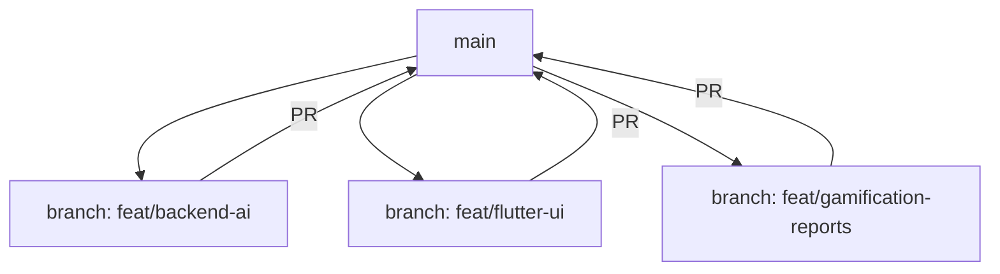

# VoiceGuru — 3-Branch Parallel Build Plan (Supabase)

Supabase project **Vaakya** is live:
- **URL**: `https://nsgpkkngknpfxkwwlwtb.supabase.co`
- **Anon Key**: `eyJhbGciOiJIUzI1NiIs...` (available in project)
- **DB is empty** — schema will be created during execution.

---

## Branch Architecture



| Branch | Owner | Scope |
|---|---|---|
| `feat/backend-ai` | **Member 1** | FastAPI + Supabase DB + RAG + Gemini + Vision |
| `feat/flutter-ui` | **Member 2** | Flutter app shell, Voice engine, Dashboard, Offline SQLite |
| `feat/gamification-reports` | **Member 3** | Gamification, Quizzes, Twilio WhatsApp, Analytics |

---

## Shared Foundation (on `main` before branching)

Before anyone branches, apply to `main`:

### Supabase Schema Migration

```sql
-- parents
CREATE TABLE parents (
  id UUID PRIMARY KEY DEFAULT gen_random_uuid(),
  phone TEXT UNIQUE NOT NULL,
  subscription_tier TEXT DEFAULT 'free' CHECK (subscription_tier IN ('free', 'premium')),
  created_at TIMESTAMPTZ DEFAULT now()
);

-- children (profiles)
CREATE TABLE children (
  id UUID PRIMARY KEY DEFAULT gen_random_uuid(),
  parent_id UUID REFERENCES parents(id) ON DELETE CASCADE,
  name TEXT NOT NULL,
  grade TEXT NOT NULL,
  board TEXT NOT NULL CHECK (board IN ('CBSE', 'ICSE', 'STATE')),
  language TEXT DEFAULT 'en-IN',
  learner_level TEXT DEFAULT 'Intermediate' CHECK (learner_level IN ('Beginner', 'Intermediate', 'Advanced')),
  hobbies TEXT[] DEFAULT '{}',
  badges_unlocked TEXT[] DEFAULT '{}',
  streak_count INT DEFAULT 0,
  last_question_date DATE,
  created_at TIMESTAMPTZ DEFAULT now()
);

-- chat logs
CREATE TABLE chat_logs (
  id UUID PRIMARY KEY DEFAULT gen_random_uuid(),
  child_id UUID REFERENCES children(id) ON DELETE CASCADE,
  query TEXT NOT NULL,
  ai_reply TEXT NOT NULL,
  subject TEXT,
  language TEXT,
  source_page TEXT,
  created_at TIMESTAMPTZ DEFAULT now()
);

-- quiz results
CREATE TABLE quiz_results (
  id UUID PRIMARY KEY DEFAULT gen_random_uuid(),
  child_id UUID REFERENCES children(id) ON DELETE CASCADE,
  subject TEXT NOT NULL,
  score INT NOT NULL,
  total INT NOT NULL DEFAULT 3,
  difficulty_before TEXT,
  difficulty_after TEXT,
  created_at TIMESTAMPTZ DEFAULT now()
);

-- RLS policies
ALTER TABLE parents ENABLE ROW LEVEL SECURITY;
ALTER TABLE children ENABLE ROW LEVEL SECURITY;
ALTER TABLE chat_logs ENABLE ROW LEVEL SECURITY;
ALTER TABLE quiz_results ENABLE ROW LEVEL SECURITY;
```

### Updated `.env` template
```
SUPABASE_URL=https://nsgpkkngknpfxkwwlwtb.supabase.co
SUPABASE_ANON_KEY=eyJhbGciOiJIUzI1NiIsInR5cCI6IkpXVCJ9...
SUPABASE_SERVICE_ROLE_KEY=<get from dashboard>
GEMINI_API_KEY=<your key>
CHROMA_DB_PATH=./chroma_db
TWILIO_ACCOUNT_SID=<sid>
TWILIO_AUTH_TOKEN=<token>
TWILIO_WHATSAPP_FROM=whatsapp:+14155238886
YOUTUBE_API_KEY=<key>
```

### Updated `requirements.txt`
```
fastapi
uvicorn
pydantic
pydantic-settings
google-genai
supabase
chromadb
python-multipart
python-dotenv
httpx
apscheduler
twilio
```

---

## Branch 1: `feat/backend-ai` — The Brain

**Owner**: Member 1  
**Scope**: FastAPI server, Supabase integration, RAG pipeline, Gemini AI, Vision endpoint

### Prompt for Member 1

> **Copy-paste this entire block into your AI coding assistant:**
>
> Act as a Senior AI Backend Architect. We are building "VoiceGuru", a voice-first EdTech app using **Supabase** (NOT Firebase). Generate production-ready Python code for all files.
>
> **Tech Stack**:
> - FastAPI + Uvicorn + Pydantic
> - `supabase` Python client (replaces firebase-admin)
> - `google-genai` (Gemini 2.0 Flash)
> - `chromadb` (RAG vector store)
>
> **Supabase Config**:
> - URL: `https://nsgpkkngknpfxkwwlwtb.supabase.co`
> - Tables: `parents`, `children`, `chat_logs`, `quiz_results` (already created)
> - Use `supabase.table("children").select("*").eq("id", profile_id).single().execute()` pattern
>
> **Directory Structure** (modify existing files in `backend/`):
> ```
> backend/
> ├── .env
> ├── requirements.txt
> ├── main.py
> ├── core/
> │   ├── config.py          # Pydantic Settings: SUPABASE_URL, SUPABASE_SERVICE_ROLE_KEY, GEMINI_API_KEY, CHROMA_DB_PATH
> │   └── supabase_client.py # Initialize supabase.create_client()
> ├── models/
> │   └── schemas.py         # ChatRequest, ChatResponse, VisionRequest, VisionResponse
> ├── services/
> │   ├── ai_service.py      # Gemini text + vision logic with System Prompts
> │   ├── db_service.py      # Supabase CRUD: get_child_profile, save_chat_log, get_weekly_logs
> │   └── rag_service.py     # ChromaDB: search_textbook, ingest_textbook
> └── routers/
>     ├── chat.py            # POST /api/v1/chat/ask
>     ├── vision.py          # POST /api/v1/chat/vision
>     └── admin.py           # POST /api/v1/admin/upload-pdf (RAG ingestion)
> ```
>
> **Key Implementation Details**:
>
> 1. **`core/supabase_client.py`**: Create a singleton Supabase client using `supabase.create_client(url, service_role_key)`.
>
> 2. **`services/db_service.py`**: Replace ALL Firebase code with Supabase:
>    - `get_child_profile(profile_id)` → `supabase.table("children").select("*").eq("id", profile_id).single().execute()`
>    - `save_chat_log(child_id, query, ai_reply, subject, language)` → `supabase.table("chat_logs").insert({...}).execute()`
>    - `get_weekly_logs(child_id)` → `supabase.table("chat_logs").select("*").eq("child_id", child_id).gte("created_at", seven_days_ago).execute()`
>
> 3. **`services/ai_service.py`**: Two functions:
>    - `generate_response(query, context, learner_level, language)` — Uses the VoiceGuru System Prompt (plain text, 4 sentences max, TTS-friendly, syllabus-locked)
>    - `generate_vision_hint(image_bytes)` — Socratic prompt: "NEVER solve the problem. Give exactly ONE hint. 3 sentences max. Plain text for TTS."
>
> 4. **`services/rag_service.py`**: 
>    - `search_textbook(query, board)` — Query ChromaDB collection by board (cbse/icse/state). Return top-1 document.
>    - `ingest_textbook(file_bytes, board, filename)` — Split text into 500-char chunks, embed via ChromaDB's default embedder, store in board-specific collection.
>
> 5. **`routers/vision.py`**: Accept `UploadFile`, read bytes, pass to `generate_vision_hint()`. Fallback: `"I can't quite read that image. Can you take a sharper photo?"`
>
> 6. **`routers/chat.py`**: Full pipeline: validate → RAG search → Gemini → save to Supabase → return. Catch-all fallback: `"I'm thinking a bit too hard right now, please ask again!"`
>
> 7. **`routers/admin.py`**: Accept PDF upload, extract text (use `PyPDF2`), pass to `ingest_textbook()`.
>
> **Output**: Complete, production-ready code for every file. Use `async` where possible. Add `PyPDF2` to requirements.txt.

---

## Branch 2: `feat/flutter-ui` — The Voice Shell

**Owner**: Member 2  
**Scope**: Flutter app, Voice engine (STT/TTS), Dashboard UI, SQLite offline cache

### Prompt for Member 2

> **Copy-paste this entire block into your AI coding assistant:**
>
> Act as a Senior Flutter Mobile Architect. We are building "VoiceGuru", a voice-first EdTech app. The backend is FastAPI (already built by a teammate). Generate complete Flutter code.
>
> **Tech Stack**:
> - Flutter (Material 3, Dark Theme)
> - `provider` (state management)
> - `speech_to_text` + `flutter_tts` (voice engine)
> - `http` (API client)
> - `sqflite` + `connectivity_plus` (offline cache)
> - `image_picker` (camera for vision solver)
> - `flutter_animate` (micro-animations)
> - `shimmer` (loading states)
> - `supabase_flutter` (auth + realtime, NOT firebase)
>
> **Backend API** (already running at `http://10.0.2.2:8000`):
> - `POST /api/v1/chat/ask` — body: `{profile_id, query, subject, language, learner_level}` → returns `{ai_reply, source_textbook_page, status}`
> - `POST /api/v1/chat/vision` — multipart: image file → returns `{ai_reply, status}`
>
> **Directory Structure**:
> ```
> lib/
> ├── main.dart
> ├── core/
> │   ├── theme.dart           # Dark Material 3 theme, Google Fonts (Outfit)
> │   ├── api_client.dart      # HTTP calls to FastAPI with 15s timeout
> │   ├── local_db.dart        # SQLite helper: create offline_cache table
> │   └── supabase_config.dart # Supabase.initialize() with URL + anon key
> ├── models/
> │   └── message_model.dart   # MessageModel: text, isUser, timestamp
> ├── providers/
> │   ├── chat_provider.dart   # Chat list, sendMessage(), offline intercept
> │   ├── voice_provider.dart  # STT/TTS, 4 states: idle/listening/processing/speaking
> │   └── profile_provider.dart# Child profile, board, language, level
> └── screens/
>     ├── dashboard_screen.dart # Chat ListView + Voice Orb + shimmer loading
>     ├── camera_screen.dart    # image_picker → POST /vision
>     └── profile_screen.dart   # Board/language selector
> ```
>
> **Key Implementation Details**:
>
> 1. **Voice Orb**: Animated floating action button at bottom-center. States:
>    - **Idle**: Gentle breathing pulse (blue glow)
>    - **Listening**: Pulsing red ring with ripple, `HapticFeedback.lightImpact()`
>    - **Processing**: Rotating gradient ring
>    - **Speaking**: Waveform animation
>    - **1.5s silence timeout**: Auto-stop listening and trigger API call
>
> 2. **Offline Cache** (`local_db.dart`):
>    - SQLite table: `offline_cache(id INTEGER PK, keywords TEXT, answer_text TEXT, language TEXT)`
>    - On every successful API response → silently insert into SQLite
>    - On no internet (via `connectivity_plus`) → SQL `LIKE '%keyword%'` search → TTS the cached answer
>
> 3. **Chat UI**:
>    - Modern dark chat bubbles with rounded corners
>    - User messages right-aligned (gradient purple), AI messages left-aligned (dark surface)
>    - `ScrollController` auto-scrolls to bottom on new message
>    - Shimmer skeleton loader while AI is generating
>
> 4. **Camera Screen**: Floating "📸 Scan Homework" button on dashboard. Opens camera → captures image → sends to `/vision` → shows hint as AI bubble
>
> 5. **Error Handling**:
>    - Custom `ErrorWidget.builder` — friendly "Oops! VoiceGuru needs a quick nap" screen instead of Red Screen of Death
>    - 15s HTTP timeout → TTS says "My internet brain is a bit slow today, let's try that again!"
>    - `SocketException` catch → switch to offline mode silently
>
> 6. **Supabase Auth**: Use `supabase_flutter` for phone OTP auth (parent login). Store session. Pass `child_id` as `profile_id` to backend.
>
> **Output**: Complete `pubspec.yaml` dependencies + all Dart files. Null-safe. Material 3.

---

## Branch 3: `feat/gamification-reports` — The Engagement Engine

**Owner**: Member 3  
**Scope**: Micro-quizzes, adaptive difficulty, badges, streaks, confetti, Twilio WhatsApp, YouTube fallback, analytics dashboard

### Prompt for Member 3

> **Copy-paste this entire block into your AI coding assistant:**
>
> Act as a Senior Product Engineer. We are building "VoiceGuru". The backend (FastAPI + Supabase) and frontend (Flutter) are being built by teammates. You own gamification, quizzes, parent reports, and multimedia. Generate complete code for both backend endpoints AND Flutter screens.
>
> **Tech Stack**:
> - Backend: FastAPI, `supabase` Python client, `google-genai`, `twilio`, `apscheduler`, `httpx`
> - Frontend: Flutter, `provider`, `confetti_widget`, `shared_preferences`, `flutter_animate`
>
> **Supabase Tables** (already exist):
> - `children`: has `learner_level`, `badges_unlocked TEXT[]`, `streak_count INT`, `last_question_date DATE`, `hobbies TEXT[]`
> - `chat_logs`: has `child_id`, `query`, `ai_reply`, `subject`, `created_at`
> - `quiz_results`: has `child_id`, `subject`, `score`, `total`, `difficulty_before`, `difficulty_after`, `created_at`
>
> **Backend Files to Create** (inside `backend/`):
> ```
> backend/
> ├── routers/
> │   ├── quiz.py            # POST /api/v1/quiz/generate, POST /api/v1/quiz/submit
> │   └── youtube.py         # GET /api/v1/media/video?query=...
> ├── services/
> │   ├── quiz_service.py    # Generate MCQ via Gemini, evaluate, update difficulty
> │   ├── report_service.py  # Weekly WhatsApp summary via Twilio
> │   └── youtube_service.py # YouTube Data API search
> └── main.py                # Register new routers + APScheduler cron
> ```
>
> **Flutter Files to Create** (inside `lib/`):
> ```
> lib/
> ├── providers/
> │   ├── quiz_provider.dart    # Quiz state, submission, confetti trigger
> │   └── gamification_provider.dart # Streaks, badges
> └── screens/
>     ├── quiz_screen.dart      # 3-question MCQ UI with timer
>     ├── badges_screen.dart    # Badge showcase with unlock animations
>     └── analytics_screen.dart # CustomPainter graphs: weekly progress, subject breakdown
> ```
>
> **Key Implementation Details**:
>
> 1. **Quiz Generation** (`quiz_service.py`):
>    - Endpoint: `POST /api/v1/quiz/generate` — body: `{child_id, subject}`
>    - Fetch child's `learner_level` from Supabase
>    - Prompt Gemini: "Generate 3 MCQ questions for a {learner_level} student on {subject}. Return JSON array: [{question, options: [A,B,C,D], correct_answer}]. No markdown."
>    - Parse JSON response, return to Flutter
>
> 2. **Quiz Submission** (`POST /api/v1/quiz/submit`):
>    - Body: `{child_id, subject, score}` (out of 3)
>    - Score 3/3 → upgrade `learner_level` to Advanced, update Supabase
>    - Score 1/3 → downgrade to Beginner
>    - Score 2/3 → no change
>    - Insert into `quiz_results` table with before/after difficulty
>
> 3. **Streak Logic** (Flutter `gamification_provider.dart`):
>    - On each question asked, check `last_question_date` in `shared_preferences`
>    - If different day → increment `streak_count`, update Supabase, trigger confetti
>    - Badges: "Science Explorer" (10 science queries), "Math Wizard" (5 vision hints), "Speed Learner" (quiz < 30s), "🔥 Streak Master" (7-day streak)
>
> 4. **Confetti** (`quiz_screen.dart`):
>    - On score 3/3 → fullscreen `ConfettiWidget` blast from top for 3 seconds
>    - On streak increment → smaller confetti burst
>
> 5. **YouTube Fallback** (`youtube_service.py`):
>    - Use YouTube Data API v3: `GET https://www.googleapis.com/youtube/v3/search?part=snippet&q={query}&type=video&maxResults=1&key={YOUTUBE_API_KEY}`
>    - Return `{video_id, title, thumbnail_url}`
>    - Flutter: Show thumbnail card below AI reply with "🎬 Tap to watch!" — opens YouTube
>
> 6. **Twilio WhatsApp Report** (`report_service.py`):
>    - APScheduler cron: every Sunday 18:00 IST
>    - For each child: fetch 7-day `chat_logs` from Supabase → send to Gemini with prompt: "Analyze this student's chat logs. Generate a 3-sentence summary for their parent. Tone: Professional and encouraging."
>    - Send via `twilio.rest.Client.messages.create(from_='whatsapp:...', to='whatsapp:...', body=summary)`
>
> 7. **Analytics Dashboard** (`analytics_screen.dart`):
>    - Use `CustomPainter` (NO charting libraries)
>    - Bar chart: questions per day (last 7 days)
>    - Pie chart: subject breakdown
>    - Animated number counters for total questions, streak, quiz average
>
> **Output**: Complete Python + Dart code for all files listed. Production-ready.

---

## Git Workflow

```bash
# On main — apply shared foundation first
git checkout main
# (apply Supabase migration, update .env, update requirements.txt)
git add . && git commit -m "chore: shared foundation — Supabase schema + config"
git push origin main

# Each member creates their branch from main
git checkout -b feat/backend-ai      # Member 1
git checkout -b feat/flutter-ui      # Member 2  
git checkout -b feat/gamification-reports  # Member 3

# After development, each member opens a PR to main
# Merge order: backend-ai → flutter-ui → gamification-reports
```

## Merge Order

> [!IMPORTANT]
> Merge in this order to avoid conflicts:
> 1. **`feat/backend-ai`** first (backend must exist before Flutter connects)
> 2. **`feat/flutter-ui`** second (UI shell must exist before gamification screens plug in)
> 3. **`feat/gamification-reports`** last (adds new routers + screens on top)

## Verification Plan

### Per-Branch
- **Branch 1**: `uvicorn main:app --reload` → test all endpoints via `/docs`
- **Branch 2**: `flutter run` → verify voice orb, chat, offline toggle (airplane mode)
- **Branch 3**: `flutter run` → trigger quiz, check confetti, verify WhatsApp message arrives

### Post-Merge
- Full E2E: Voice question → AI reply → quiz → badge → WhatsApp report
- Airplane mode test: ask cached question offline → TTS plays answer
- Vision test: upload homework photo → get Socratic hint (not answer)
